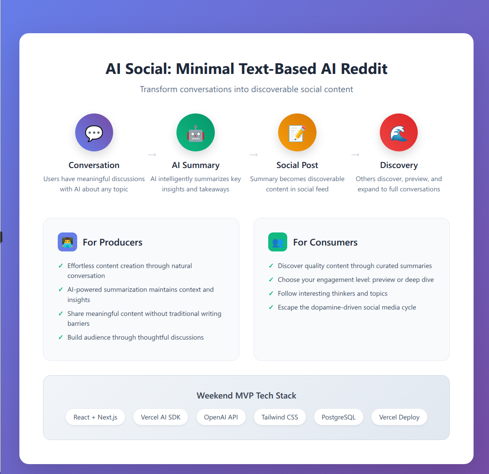
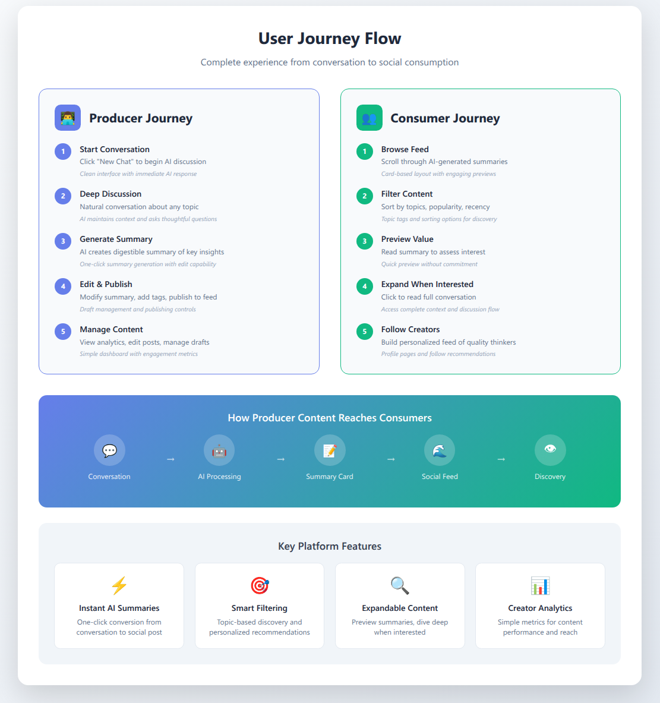
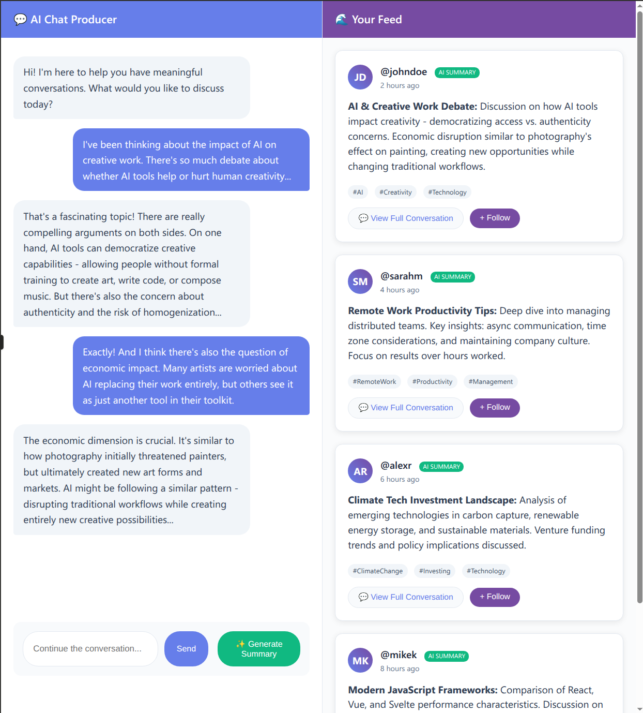
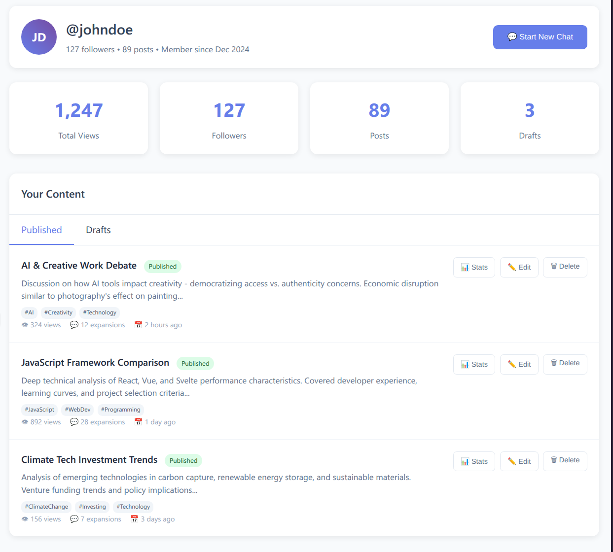
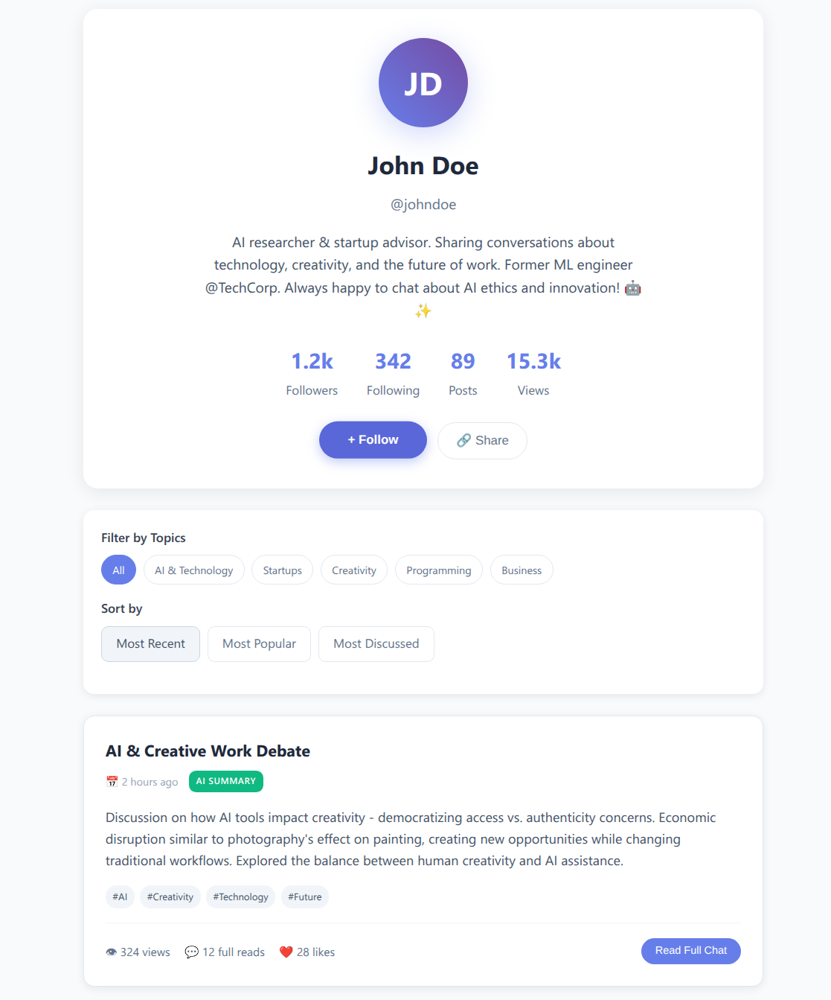

# AIkya: Diverse Thoughts, Unified Wisdom

**Transform meaningful AI conversations into discoverable social content**

---

## 🎯 Product Overview


*Visual overview showing the complete flow from AI conversations to social discovery*

### Core Concept
AIkya bridges the gap between deep AI conversations and bite-sized social consumption. Users engage in meaningful discussions with AI, generate intelligent summaries, and share them in a community that values substance over viral content.

### The Problem We're Solving
- **Information Overload**: People want meaningful content but are overwhelmed by endless feeds
- **Attention Fragmentation**: Current social media destroys focus with dopamine-driven design
- **Shallow Content**: Most platforms optimize for engagement over substance
- **Content Creation Barriers**: Quality content requires significant writing skills and time

### Our Solution
A two-sided platform that democratizes thoughtful content creation:
- **Producers**: Transform natural conversations into shareable insights
- **Consumers**: Discover curated content with flexible engagement levels

---

## 🚀 Value Proposition

### For Content Creators (Producers)
- **Effortless Content Creation**: Turn natural conversations into social posts
- **AI-Powered Curation**: Intelligent summarization maintains context and key insights
- **No Writing Barriers**: Share meaningful content without traditional writing skills
- **Authentic Voice**: Content emerges from genuine thinking, not performative posting

### For Content Consumers
- **Quality Over Noise**: Curated, meaningful content vs mindless scrolling
- **Flexible Depth**: Preview summaries, dive deep when interested
- **Discovery Engine**: Find interesting thinkers and topics through AI-curated insights
- **Healthier Social Media**: Promotes reflection over reaction

### Business Value
- **Democratizes Expert Content**: Anyone can create thoughtful content through conversation
- **Reduces Content Creation Friction**: Lower barrier to entry for quality content
- **Healthier Social Media Model**: Focus on substance creates more engaged, loyal users

---

## 📱 User Experience Flow


*Detailed user journey flowchart showing producer and consumer paths with key platform features*

### Producer Journey
1. **Start Conversation**: Natural dialogue with AI about any topic
2. **Deep Discussion**: AI maintains context and asks thoughtful questions
3. **Generate Summary**: One-click AI summarization of key insights
4. **Edit & Publish**: Customize summary, add tags, publish to feed
5. **Manage Content**: Track performance and manage content library

### Consumer Journey
1. **Browse Feed**: Scroll through AI-generated conversation summaries
2. **Filter Content**: Discover content by topics, creators, or popularity
3. **Preview Value**: Read summaries to assess interest level
4. **Expand When Interested**: Access full conversations for deeper context
5. **Follow Creators**: Build personalized feed of quality thinkers

---

## 🎨 Interface Design

### Main Application Layout

*Split interface showing chat conversation on left and social feed on right*

- **Chat Interface**: Clean conversation UI with streaming AI responses
- **Social Feed**: Card-based layout with expandable summaries
- **Seamless Integration**: Easy transition from private conversation to public sharing

### Creator Dashboard

*Weekend MVP creator dashboard with essential content management features*

- **Content Management**: Draft and published post organization
- **Performance Analytics**: Basic engagement metrics and follower insights
- **Publishing Workflow**: Simple path from conversation to published content

### Profile Pages

*Consumer view of a producer's profile with content filtering and discovery*

- **Content Discovery**: Topic-based filtering and chronological browsing
- **Creator Showcase**: Profile highlighting expertise and conversation topics
- **Follow System**: Build networks around shared interests and quality thinking

---

## 🛠 Technical Architecture

### System Architecture
```
React Frontend → FastAPI Backend → OpenAI API → PostgreSQL Database
├── Next.js (UI Components)    ├── Pydantic Models           └── User Data
├── Tailwind (Styling)         ├── SQLAlchemy ORM               └── Posts
└── API Integration            └── JWT Authentication           └── Analytics
```

### Core Technology Stack
- **Backend**: FastAPI + SQLAlchemy + Pydantic
- **Frontend**: React + Next.js + Tailwind CSS
- **AI Integration**: OpenAI Python SDK
- **Database**: PostgreSQL + Alembic migrations
- **Authentication**: JWT tokens + FastAPI Security
- **Deployment**: Railway/Render (backend) + Vercel (frontend)

### Key Features
- **Real-time AI Streaming**: Responsive conversation experience
- **Intelligent Summarization**: Context-aware content generation
- **Scalable Architecture**: Microservices-ready separation of concerns
- **Modern Developer Experience**: Type-safe APIs and component reusability

---

## 💡 Unique Differentiators

### vs Traditional Social Media
- **Substance Over Engagement**: Optimizes for meaningful content, not dopamine hits
- **AI-Augmented Creation**: Makes thoughtful content creation accessible to everyone
- **Flexible Consumption**: Choose your level of engagement (summary vs full conversation)
- **Quality Discovery**: Find content through intelligence, not algorithmic manipulation

### vs Reddit/Discussion Platforms
- **AI-Powered**: Intelligent summarization vs manual posting
- **Conversation-First**: Content emerges from natural dialogue
- **Creator-Focused**: Follow people for their thinking, not just topics
- **Lower Friction**: No need to craft perfect posts or comments

### vs AI Chat Platforms
- **Social Layer**: Community and discovery vs isolated interactions
- **Persistent Value**: Conversations become discoverable knowledge
- **Curation**: Human-AI collaboration vs pure AI generation
- **Network Effects**: Building knowledge networks through shared insights

---

## 📊 Market Opportunity

### Target Users
- **Early Adopters**: Tech-savvy professionals seeking meaningful online interactions
- **Knowledge Workers**: Consultants, researchers, analysts sharing expertise
- **Thought Leaders**: Experts wanting to share insights without content creation overhead
- **Curious Learners**: People seeking substantive content over entertainment

### Market Positioning
- **Primary**: Alternative to traditional social media for professionals
- **Secondary**: AI-powered content creation tool for non-writers
- **Tertiary**: Knowledge discovery platform for specific domains

---

## 🎯 Success Metrics

### User Engagement
- **Conversation Depth**: Average messages per conversation
- **Summary Quality**: Expansion rate (summaries → full conversations)
- **Content Discovery**: Time spent reading vs scrolling
- **Creator Retention**: Percentage of users who publish multiple posts

### Network Effects
- **Follow Relationships**: Growth in creator-consumer connections
- **Content Virality**: Cross-pollination of ideas between user networks
- **Topic Evolution**: Emergence of new conversation themes
- **Knowledge Building**: Conversations that reference previous content

### Product-Market Fit Indicators
- **Organic Growth**: User referrals and word-of-mouth adoption
- **Content Quality**: User-generated content that provides genuine value
- **Retention**: Users returning for both creation and consumption
- **Network Density**: Strong connections between users based on shared interests

---

## 🔮 Future Vision

### Phase 2 Features
- **Enhanced AI**: Multiple model support, conversation threading, topic suggestions
- **Advanced Discovery**: Semantic search, personalized recommendations, trending topics
- **Community Features**: Comments, reactions, collaborative conversations
- **Creator Tools**: Advanced analytics, content scheduling, audience insights

### Long-term Potential
- **Vertical Expansion**: Domain-specific instances (legal, medical, technical)
- **Enterprise Applications**: Internal knowledge sharing, expert consultation
- **Educational Integration**: Classroom discussions, research collaboration
- **API Ecosystem**: Third-party integrations and developer platform

### Monetization Opportunities
- **Premium AI Features**: Access to advanced models and conversation capabilities
- **Creator Tools**: Enhanced analytics, content management, and audience building
- **Enterprise Licensing**: Private instances for organizations
- **Knowledge API**: Programmatic access to curated conversation insights

---

## 🤝 Collaboration Opportunities

### For Developers
- **Backend Specialists**: API optimization, database design, AI integration
- **Frontend Experts**: Component architecture, user experience, mobile optimization
- **Full-Stack Engineers**: End-to-end feature development and system integration

### For Designers
- **UX Researchers**: User flow optimization and behavior analysis
- **Visual Designers**: Component systems, branding, and aesthetic refinement
- **Product Designers**: Feature conceptualization and user-centered design

### For Domain Experts
- **AI/ML Engineers**: Advanced conversation processing and recommendation systems
- **Product Managers**: Feature prioritization and go-to-market strategy
- **Community Builders**: User engagement and network growth strategies

---

**AIkya represents a new paradigm for social media - one that values depth over breadth, quality over quantity, and meaningful connection over viral engagement.**